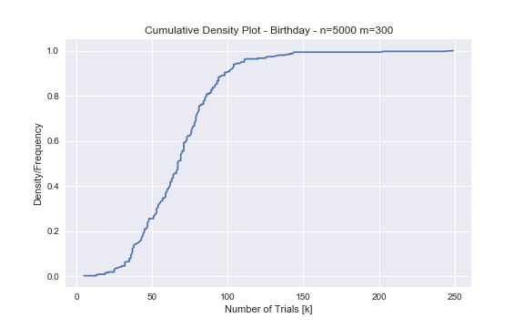
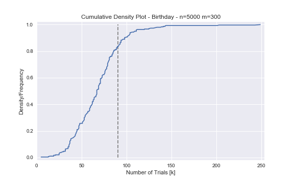
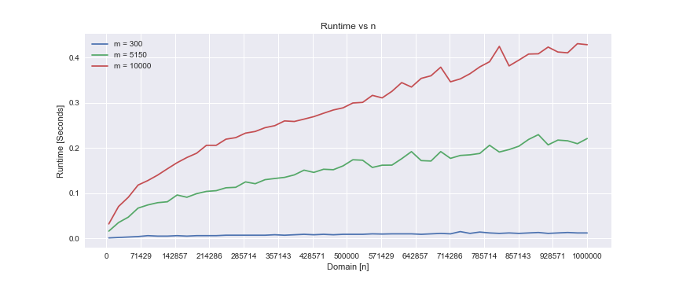
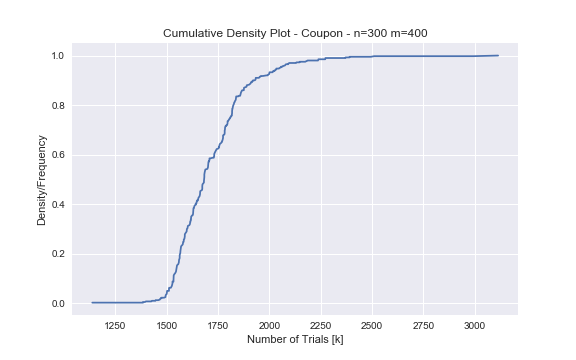
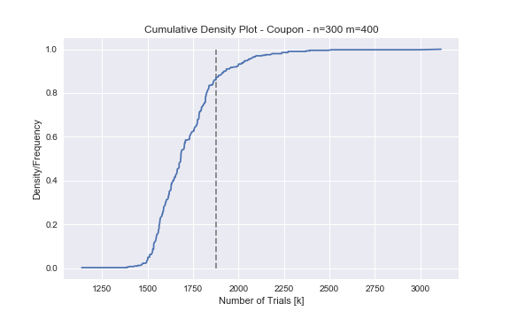
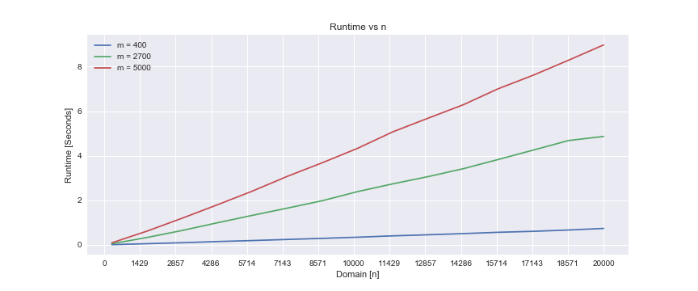

# Data Mining Assignment 1

*Author: Lukas Gust*

*Due: Jan. 16th*

## 1 Birthday Paradox

**Description:**

Consider a domain of size $n=5000$.

**A:** Generate random numbers in the domain $[n]$ until two have the same value. How many random trials did this take? We will use $k$ to represent this value.

**B:** Repeat the experiment $m=300$ times, and record for each time how many random trials this took. Plot this data as a *cumulative density plot* where the x-axis records the number of trials required $k$, and the y-axis records the fraction of experiments that succeeded after $k$ trials.

**C:** Empirically estimate the expected number of $k$ random trials in order to have a collision. 

**D:** Describe how you implemented this experiment and how long it took for $m=300$ trials. Show a plot of the runtime as you gradually increase the parameters $n$ and $m$.

**Solution:**

**A:** Using python, `random` & `numba` we generate random integers in the interval $[1,n]$ with $n=5000 $ until we have a duplicate. $k$ represents this value.

```python
@jit
def coupon0(n):
    nums = set()
    k = 0
    num = 0
    while True:
        if len(nums) == n:
            return k
        num = int(n*random.random())
        nums.add(num)
        
        k += 1
            
print(birthday(5000))
```

```
132
```

Hence our experiment yielded $k=100​$. That is, it took 100 trials before we had a duplicate value in our data.

**B:** Now we repeat our experiment $m=300$ times for the same $n$ and save our $k$'s. Then we plot a *cumulative density plot* from the data gathered from the $m$ experiments.



**C:** The estimated expected number of $k$ trials is $90.69$, but since a trial is a whole number we will round it up to $91$. In symbols, $E[k] \approx 91$. 



**D:** *Implementation:*  The experiment was implemented using python and some libraries for built in functionality and plotting, e.g. `numpy`, `scipy.stats`, `matplotlib`.  We simply run the birthday function defined above $m=300$ times and keep track of the number of trials required for each experiment then perform the empirical analysis. To find the duplicates we search through a python dictionary to see if it is in there already. Using the `timeit` library we can get an average execution time for the experiments. 977 µs ± 8.97 µs with $m=300$ and $n=5000​$ using `numba`. 

*Runtime:* Now we will change the values of $m,n$, then we will plot the runtimes against $n$ for $m=300,5150,10000$ and 10 equally spaced values of $n$ between 5000 & 1000000. Here is the plot:



## 2 Coupon Collector

**Description:**

Consider a domain of size $n=300$.

**A:** Generate random numbers in the domain $[n]$ until every value $i \in [n]$ has had one random number equal to $i$. How many random trials did this take? We will use $k$ to represent this value.

**B:** Repeat step A for $m=400$ time, and for each repetition record the value $k$ of how many random trials we required to collect all values $i \in [n]$. Make a cumulative density plot as in 1.B.

**C:** Use the above results to calculate the empirical expected value of $k$.

**D:** Describe how you implemented this experiment and how long it took for $n=300$ and $m=400$. trials. Show a plot of the run time as you gradually increase the parameters $n$ and $m$.

**Solution:**

**A:** Basic idea is to generate random numbers and update a boolean array using the number as the index. once our number of unique updates is equal to $n$ , then we have seen all the numbers $i \in [n]​$.

```python
@jit
def coupon1(n):
    collected = np.full(n, False)
    k = 0
    unique = 0
    rand = random.random
    
    while unique < n:
        num = int(n*rand())
        if not collected[num]:
            unique += 1
            collected[num] = True
        k += 1
    
    return k
```

```
1687
```

Hence our experiment yielded $k=1687​$. That is, it took 1687 trials before we every value $i \in [n]​$.

**B:** Simply loop through 400 times and keep track of the number of trials.



**C:** Our expected number of trials $k$ is $1875.305$, but since a trial is a whole number we will round it down to $1857$. In symbols, $E[k] \approx 1857$.



**D:** *Implementation:* This simulation was implemented using python and some libraries from it. We initialize an array of bools as False. We need to keep track of the number of unique updates so we know when to stop and of course the number of trials $k$. While the number of unique updates in less than $n$ we generate the appropriate random integer and use it to index into our bools and update the bool if its False, i.e. we haven't seen it yet. The runtime for $n=300$ and $m=400$ is 7.18 ms ± 53.4 µs.

*Runtime:* Below is the plot of runtimes.



## 3 Comparing Experiments to Analysis

**Description:**

**A:** Calculate analytically the number of random trials needed so there is a collision with probability at least $0.5$ in a domain of size $n=5000$. How does this compare to your results from 1.C?

**B:** Calculate analytically the expected number of random trials before all elements are witnessed with a in a domain of size $n=300$. How does this compare to your results from 2.C?

**Solution:**

**A:** Let $X$ be the number of trials before a collision happens. We know that:
$$
P(X=k)=1-\prod_{i=1}^{k-1}{ \left( \dfrac{n-i}{n} \right)}
$$
Recall that for $x$ close to zero $e^{x} \approx 1 + x$. Applying this approximation allows us to find the k needed to achieve at least $0.5$ probability.
$$
\begin{align*}
1-\prod_{i=1}^{k-1}{ \left( \dfrac{n-i}{n} \right)} &\approx
1-\prod_{i=1}^{k-1}{e^{-\frac{i}{n}}} \\

&= 1-\prod_{i=1}^{k-1}{e^{-\frac{i}{n}}} \\
&= 1-e^{\frac{1}{n}-\sum_{i=1}^{k-1}i} \\
&= 1-e^{\frac{-k(k-1)}{2n}} \quad \text{since} \sum_{i=1}^{n}i = \frac{n(n+1)}{2}\\
\end{align*}
$$
So for some desired probability $p$ we can approximately compute the $k$ needed to achieve probability $p​$.
$$
\begin{align*}
p &\leq 1-e^{\frac{-k(k-1)}{2n}} \\
\iff -\ln(p-1) &\leq \frac{k(k-1)}{2n} \\
\iff \frac{-\ln(p-1)}{2n} &\leq k(k-1) \leq k^{2} \\
\iff \sqrt{\frac{-\ln(p-1)}{2n}} &\leq k 
\end{align*}
$$
If we let $p=0.5$ then we get $k=83.3$ which we will round up to $k=84$. We can check our $k$ by using an approximate probability $1-(1-\frac{1}{5000})^{84\choose{2}} = 0.502$. So therefore at least $k=84$ will give us a 50% chance of seeing a collision. This is pretty close to our empirical expected value of $k$. If we eyeball $0.5$ on our density plot we can see that it is close enough to be confident in the accuracy of our experiment. We could run the experiment multiple times with a different generation of numbers to further validate it.

**B:** In the notes from **L2** we derived the expected number of coupons we would need to buy to collect all $n$ of them. The formula: $k=nH_{n} \approx n(\gamma + \ln{n})$ ,where $\gamma \approx 0.577$. $H_{n}$ is the harmonic number. So we simply  substitute the values $n=300$ and $\gamma$ into the formula to get $k$.
$$
k = 300H_{n} = 300(0.577 + \ln{300}) = 1884.235 \approx 1885.
$$
We would expect that collecting 1885 coupons from a pool of 300 will result in having collected all possible coupons. So again it seems that our analysis jives well with our experiments. The analytical expected value is very close to the empirical expected value.

## End

