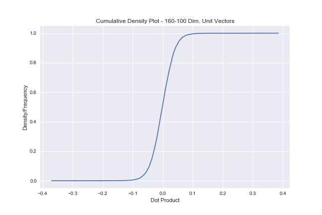

# Data Mining Assignment 3

*Author: Lukas Gust*

*Due: Feb. 6th*

## 1 Choosing $r,b$

**Description:**

Consider computing LSH using $t=160$ hash functions. We want to find all object pairs which have Jaccard similarity above $\tau=0.85$.

**A:** Use the trick mentioned in class and the notes to estimate the best values of hash functions $b$ within each of $r$ bands to provide the S-curve
$$
f(s)=1-(1-s^b)^r
$$
with good separation at $\tau$. Report these values.

**B:** Consider the 4 objects $A,B,C,D$, with the following pair-wise similarities:

|       | A    | B    | C    | D    |
| :---- | ---- | ---- | ---- | ---- |
| **A** | 1    | 0.75 | 0.25 | 0.35 |
| **B** | 0.75 | 1    | 0.1  | 0.45 |
| **C** | 0.25 | 0.1  | 1    | 0.92 |
| **D** | 0.35 | 0.45 | 0.92 | 1    |

Using your choice of $r$ and $b$ and $f(\cdot)$, what is the probability of each pair of the four objects for being estimated to having similarity greater that $\tau=0.85$? Report 6 numbers. (*Show your work.*)

**Solution:**

**A:** For this we will use the "rule of thumb" mentioned in class. That is take
$$
b=-\log_{\tau}(t)\\
r= t/b
$$
Since we know $\tau$ and $t$ we can easily compute the best values of $r,b$ that make the steepest slope at $\tau$. We will also show a plot so that we can see the curve that is produced.
$$
b=-\dfrac{\ln{t}}{\ln{\tau}} \approx 32
$$
and
$$
r=\dfrac{t}{b} = \dfrac{160}{31} \approx 5
$$
Now we can plot $f$ and see if our choice of $r,b$ is any good.

As we can see the black line is $\tau=0.85$ and the curve is not capturing the desired threshold well. So now we experiment, a lot, with $r,b$ and we find that $b=31$ and $r=100$ produces a better curve for our threshold $\tau$.

**However** this does not satisfy our budget of $t=160$. So we must find a better one that fits our budget. After more experimenting we need $r$ to be bigger while not making $b$ too small. The sweet spot ended up being $b=16$ and $r=16$.

**B:** For this we can ignore the diagonal since the probability is 1 for the similarity of a set with itself. Notice that the pair-wise matrix above is symmetric (as it should be) so we only need to compute the probability for the upper half or lower half.

Here is all of the work
$$
s_1 = \hat{\text{JS}}_t(A,B) = 0.75\\
s_2 = \hat{\text{JS}}_t(A,C) = 0.25\\
s_3 = \hat{\text{JS}}_t(A,D) = 0.35\\
s_4 = \hat{\text{JS}}_t(B,C) = 0.1\space\space\\
s_5 = \hat{\text{JS}}_t(B,D) = 0.45\\
s_6 = \hat{\text{JS}}_t(C,D) = 0.92
$$
Now for the computation
$$
\begin{align*}
f(s_1) &= 0.0958\\
f(s_2) &= 2.33\times10^{-9}\\
f(s_3) &= 5.07\times10^{-7}\\
f(s_4) &= 1.11\times10^{-15}\\
f(s_5) &= 2.83\times10^{-5}\\
f(s_6) &= 0.9530
\end{align*}
$$
And our choice works well for $s_1​$ we can see that it is close to $0​$ even for how close $0.75​$ is to our threshold. For $s_6​$ we suspected that it should be close to one and it is. Note that if we kept our original "rule of thumb" $r,b​$ our probability for $s_6​$ would be $f(s_6) =0.32​$ which is not good enough.

## 2 Generating Random Directions

**Description:**

**A:** Describe how to generate a single random unit vector in $d=10$ dimensions using only the operation $u \leftarrow \text{unif}(0,1)$ which generates a uniform random variable between $0$ and $1$. 

**B:** Generate $t=160$ unit vectors in $\R^d$ for $d=100​$. Plot the cdf of their pairwise dot products.

**Solution:**

**A:** We can use the wonderful property that a gaussian RV's coordinates are independent of each other. If we were to just use two uniform RV's and normalize them then we would have a bias and the vector generation would not be reasonable. Similar issues arise when you try to generate uniformly random numbers with in a circle/sphere. So first we generate two $\text{unif}(0,1)$ $u_1,u_2$ and then transform (Box-Muller) them in such a way that they land on the unit ball in whatever dimension we need. The transformation is as follows.
$$
y_1 = \sqrt{-2\ln{u_1}}\cos{2\pi u_2}\\
y_2 = \sqrt{-2\ln{u_1}}\sin{2\pi u_2}
$$
Then we have a random unit vector in $\R^2$. In the case where we want to generate random unit vectors in $\R^{10}$ we need to generate 5 pairs and they will all be independent. In other words use a $\text{unif}(0,1)$ and the transformation above to generate 5 pairs of points and combine them into a single *d*-dimensional vector.

Alternatively it is possible to generate *d*-dimensional vectors using *d* gaussian random variables with mean 0.

**B:** We will use two methods and plot both dot product CDF's to see that they are in fact very similar if not the same. Note: we will use the same plotting technique from **A2**.

First we simply generate $d=100$ iid $N(0,1)$ random numbers and that is one of the $t$ vectors. Then we compute the $t \choose2$ dot products and plot a CDF of the values. 

Here is the result:

Second we use the Box-Muller transformation as described above except $d=100$. So we generate $50$ pairs and combine them into a single 100-dimensional vector. 

Here are the results:

And here is the comparison of the two graphs layered on top of one another:

As we can see these are nearly identical so it is reasonable to assume that they are distributed properly.

# 3

**Description:**

Consider the $n=500$ data points in $\R^d$ for $d=100$ in data set `R`, given at the top. We will use the angular similarity between two vectors $a,b \in \R^d$:
$$
\textbf{s}_\text{ang}(a,b) = 1 - \dfrac{1}{\pi}\arccos(\langle \bar{a}, \bar{b} \rangle).
$$
If $a,b$ are not unit vectors, then we covert them to $\bar{a}=a/||a||_2$ and $\bar{b}=a/||b||_2$. The definition of $\textbf{s}_\text{ang}(a,b)$ assumes that the input are unit vectors, and takes a value between 0 and 1, with 1 meaning most similar.

**A:** Compute all pairs of dot products, and plot a CDF of their angular similarities. Report the number with similarity greater than $\tau=0.85$.

**B:** Now compute the dot products and angular similarities among $t \choose 2$ pairs of the $t$ random vectors unit vectors from **Q2.B**. Again plot the CDF, and report the number with angular similarity above $\tau=0.85$.

**Solution:**

**A:** We read in the file and compute the angular similarity defined above. Then we compute the CDF of this similarity. 

Here is the CDF.

Using a simple filter we can find the number of combinations that have a similarity above $\tau=0.85$. It is also possible to report the pairs that have this similarity or greater.

We found there to be $67299$ pairs that have a similarity greater than $\tau=0.85$. This is a little over $50\%$ of the $n \choose 2$ combinations.

**B:** Now we repeat the same process with the random unit vectors generated in **Q2.B**.

Here is the CDF:

The number of similarities above $\tau=0.85$ is $0​$.

## End

