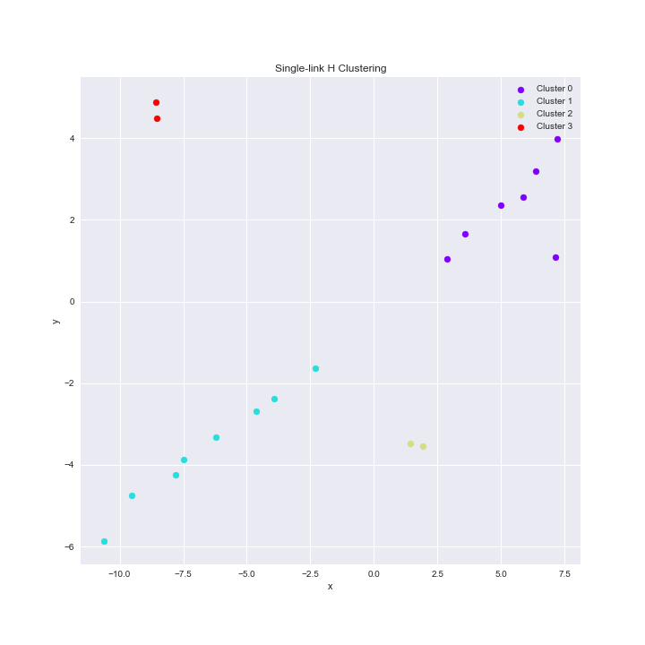
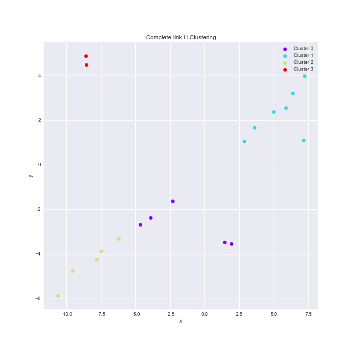
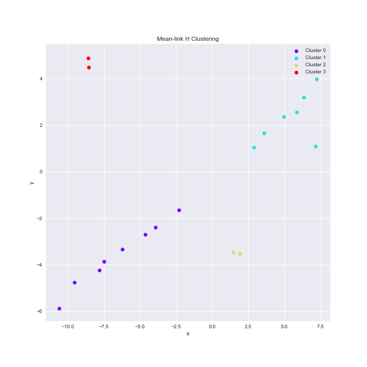
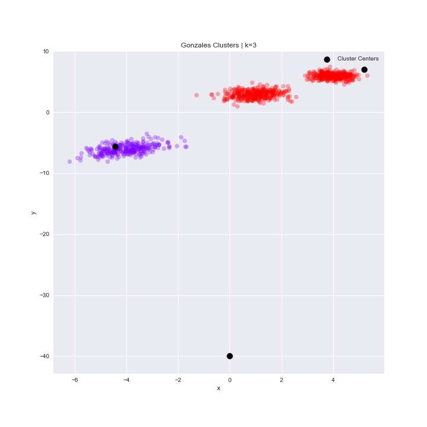
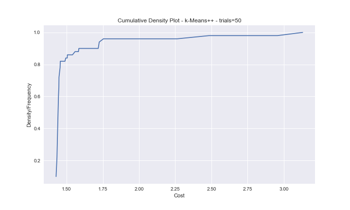
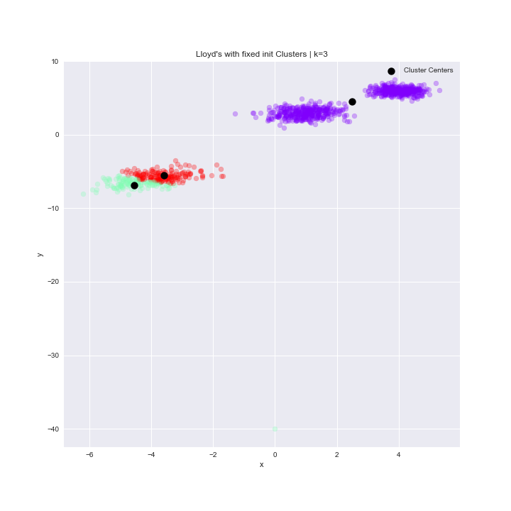
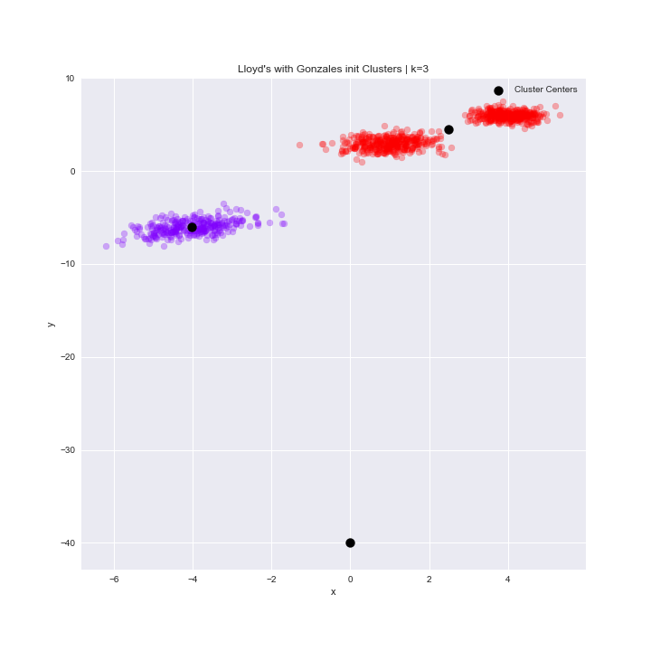
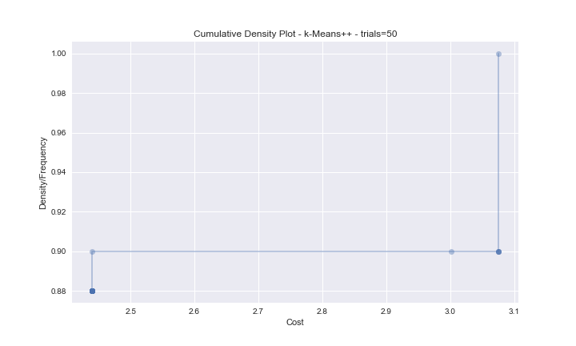

# Data Mining Assignment 4

*Author: Lukas Gust*

*Due: Feb. 20th*

## 1 Hierarchical Clustering

**Description:**

There are many variants  of hierarchical clustering; here we explore 3. The key difference is how you measure the distance $d(S_1,S_2)$ between two clusters $S_1$ and $S_2$.

Single-Link: measures the shortest link $d(S1, S2) = \min_{
(s_1,s_2)∈S_1×S_2}
||s_1 − s_2||_2$.
Complete-Link: measures the longest link d(S1, S2) =  $d(S1, S2) = \max_{
(s_1,s_2)∈S_1×S_2}
||s_1 − s_2||_2$.
Mean-Link: measures the distances to the means. First compute $a_1 = \frac{1}{|S_1|} \sum_{s \in S_1}s$ and $a_2= \frac{1}{|S_2|}\sum_{s \in S_2}s$, then $d(S_1,S_2)=||a_1-a_2||_2$

**A:** Run all hierarchical clustering variants on data set `C1.txt` until there are $k=4$ clusters, and report the results as sets. 

**B:** Which variant did the best job, and which was the easiest to compute? Explain your answers.

**Solution:**

**A:** I will report the clusters on a plot since the data set is in two dimensions. I hope this is enough.

<u>Single-Link:</u> 

As we can see the clustering seems reasonable. 

<u>Complete-Link:</u> 

As we can see the clustering doesn't seem to work correctly on this dataset. 

<u>Mean-Link:</u> 

As we can see the clustering seems reasonable. 

**B:** First, the complete link performed the worst. Other than that both mean and single link worked well on this data set. They are all relatively easy to compute. They all follow the same algorithm just with different definitions of cluster distance. The complete link would probably perform better on a larger data set with more grouped clusters. The other two work well on clusters that may not be grouped normally.

## 2 Assignment-Based Clustering

**Description:**

Assignment-based clustering works by assigning every point $x \in X$ to the closest cluster centers $C$. Let $\phi_C:X \rightarrow C$ be this assignment map so that $\phi_C(x) = \text{argmin}_{c \in C}d(x,c)$. All points that map to the same cluster center are in the same cluster.

Two good heuristics for these types of clusters are the Gonzalez and $k$-Means++ algorithms.

**A:** Run Gonzalez and $k$-Means++ on data set `C2.txt` for $k=3$. To avoid too much variation in the results, choose $c_1$ as the point with index 1.

Report the centers and the subsets (as pictures) for Gonzales. Report

+ the 3-center cost $\max_{x \in X}d(x, \phi_C(x))$, and
+ the 3-means cost $\sqrt{\frac{1}{|X|}\sum_{x \in X}(d(x,\phi_C(x)))^2}$

**B:** For $k$-Means++, the algorithm is randomized, so you will need to report the variation in this algorithm. Run it several times (at least 20) and plot the CDF of the 3-means cost. Also report what fraction of the time the subsets are the same as the result from Gonzalez.

**C:** Recall that Lloyd's algorithm for $k$-means clustering starts with a set $k$ centers $C$ and runs as described in Algorithm 9.2.1.

1. Run Llyod's Algorithm with $C$ initially with points indexed `{1,2,3}`. report the final subset and the 3-means cost.
2. Run Llyod's Algorithm with $C$ initially as the output of the Gonzalez above. Report the final subset and the 3-means cost.
3. Run Llyod's Algorithm with $C$ initially as the output of each run of $k$-Means++ above. Plot a CDF of the 3-means cost. Also report the fraction of the trials that the subsets are the same as the input (where the input is the result of $k$-Means++).

**Solution:**

**A:** After running the algorithm I obtained the following clustering.

Note: the bottom cluster belongs to one point. It is hard to see because the cluster center is plotted on the same exact point.

The 3-center cost is $7.7721$, and 

The 3-means cost is $3.6943$.

**B:** After running the algorithm 50 times here is the cdf.

With the subset reported by $k$-Means++ being the same as Gonzalez 0% of the time over 50 trials.

**C:** 

1. First we run Lloyd's with the initial centers as the indices from above and obtain the following clustering and cost. Cost: $3.0010$

2. Now we run Lloyd's with the Gonzalez centers as the initializastion and obtain the following clustering and cost. Cost: $3.0747$

3. For the $k​$-Means++ initialization we show the cdf of the cost and the fraction of the time the centers are the same as the init input.

The subsets of this implementation of Lloyd's were the exact same as the $k$-Means++ input 0% of the time, However the majority of the the runs only updated once before we had convergence. More than 50% of the time for this run of 50 trials.

## End

