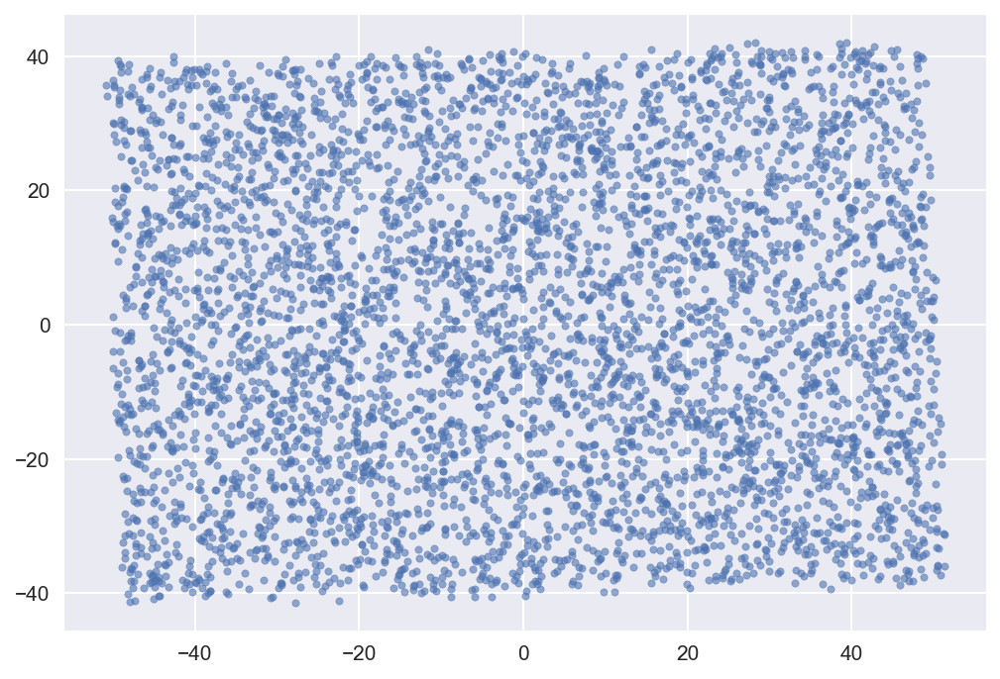
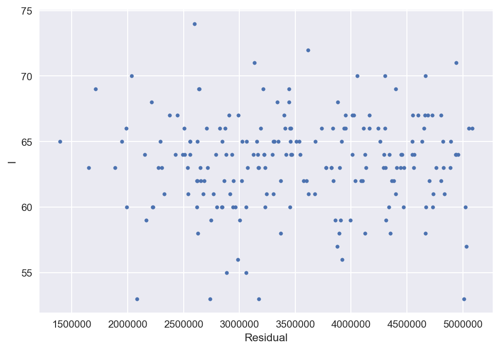

# Data Mining Assignment 7

*Author: Lukas Gust*

*Due: April 3rd*

## 1 Singular Value Decomposition

**Description:**

First we will compute the SVD of the matrix A we have loaded `[U,S,V] = svd(A)`.

Then take the top $k$ components of A for values of $k = 1$ through $k=10$ using

```
Uk = U(:,1:k)
Sk = S(1:k,1:k)
Vk = V(:,1:k)
Ak = Uk*Sk*Vk'
```

**A:** Compute and report the $L_2$ norm of the difference between A and Ak for each value of $k$ using

 `norm(A-Ak, 2)`.

**B:** Find the smallest value $k$ so that the $L_2$ norm of A-Ak is less than 10% that of A; $k$ might or might not be larger than 10.

**C:** Treat the matrix as 5000 points in 40 dimensions. Plot the points in 2 dimensions in the way that minimizes the sum of residuals squared, and describe briefly how you did it.

 **Solution:**

**A:** We compute the norms for both the centered and non-centered data. The norms end up being the same for both. Given is the code used to produce the approximation and its output.

```python
for k in range(1,11):
    Uk = U[:,0:k]
    Sk = S[0:k]
    Vk = V[0:k,:]
    Ak = Uk * Sk @ Vk
    L2 = np.linalg.norm(A-Ak, ord=2)
    print('k={}'.format(k), (L2))
```

Output:

```
k=1 1630.20809879
k=2 1432.63091874
k=3 1010.34378166
k=4 827.826924281
k=5 815.80220851
k=6 802.931083964
k=7 614.323096088
k=8 510.429366507
k=9 308.945786079
k=10 206.611739165
```

**B:** Given is the code used to check which $k$ gives 10% of the norm of A. 

```python
for k in range(1,41):
    Uk = U[:,0:k]
    Sk = S[0:k]
    Vk = V[0:k,:]
    Ak = Uk * Sk @ Vk
    L2 = np.linalg.norm(A-Ak, ord=2)
    if np.linalg.norm(A, ord=2)*.1 > L2:
        print('k={} (10% A:{}, Ak:{})'.format(k, np.linalg.norm(A, ord=2)*.1, L2))
        break
```

Output (non-centered A):

```
k=8 (10% A:636.6474948247128, Ak:526.8578361869166)
```

Output (centered A):

```
k=11 (10% A:203.5764567208041, Ak:203.11004107063303)
```

**C:** We simply us the the first two rows of V from the `svd(A)` where A has been centered and dot those with A. We obtain a $n \times 2$ and we treat each row as an ordered pair. i.e. PCA.



## 2 Frequent Directions and Random Projections

**Description:**

Use the stub file `FD.m` to create a function for the Frequent Directions algorithm. We will consider running this code on matrix A.

**A:** We can measure the error $\max_{||x||=1}|||Ax||^2 - ||Bx||^2|$ as `norm(A'*A - B'*B, 2)`.

+ How arge does $l​$ need to be for the above error to be at most $||A||^2_F/10​$?
+ How does this compare to the theoretical bound (e.g. for $k=0$)?
+ How large does $l$ need to be for the above error to be at most $||A-A_k||^2_F/10$ (for $k=2$)?

**B:** Create another $l\times d$ matrix B, but using random projections. You can do this by creating an $l \times n$ matrix $S$, and letting $B=SA$. Fill each entry of $S$ by an independent normal random variable $S_{i,j} = \dfrac{\sqrt{l}}{\sqrt{n}}N(0,1)$.

Estimate how large should $l$ be in order to achieve $\max_{||x||=1}|||Ax||^2 - ||Bx||^2| \le ||A||^2_F/10$. To estimate the relationship between $l$ and the error in this randomized algorithm, you will need to run multiple trials. Be sure to describe how you used these multiple trials, and discuss how many you ran and why you thought this was enough trials to run to get a good estimate. 

**Solution:**

**A:** First here is the FD function defined in python.

```python
def freq_directions(A, l): # can be adapted to a streaming setting.
    B = np.zeros((2*l, A.shape[1]))
    
    for a in A:
        for i, b in enumerate(B):
            if np.all(b == 0):
                B[i] = a
                break
                
        if not np.all(B == 0):
            U, S, V = np.linalg.svd(B, full_matrices=False)
            delta = S[l]**2
            Sp = np.diag(np.hstack([(S[:l]**2-delta)**.5, np.zeros((l))]))
            B = Sp @ V
            
    return B     
```

Now we run this function for a range of $l​$ to arrive at the following conclusion for $||A||^2_F/10= 5091577.32179​$:

```
l=3  err=3431031.62792539
```

Compared to the theoretical bound $\text{err} \le ||A||^2_F/10 \le ||A||^2_F/2 = 25457886.608933121​$. So we have found a better bound for $k=0​$.

Now we find the best $l$ for a rank-k approximation $A_k$ for $k=2$.

$||A-A_k||^2_F/10 = 691449.069943$

```
l=8  err=501924.88326510735
```

So at $l=8$ we have an error at most $||A-A_k||^2_F/10$.

**B:** Here is the code that produces the random projections:

```python
def rand_proj(A,l):
    n, d = A.shape
    S = np.random.normal(scale=np.sqrt(l)/np.sqrt(n), size=(l,n))
    B = S @ A
    return B
```

After running 200 trials we obtain an average $l$ of 64 which happens to be the median as well. This is how large $l$ needs to be in expectation to satisfy the condition stated. Here is the relationship between $l$ and the residual.



We can see that the lower $l$ is the closer the residual is the bound. So in picking $l$ to be 64 or above will result in a good performance. Any more trials than 200 gives the same or similar result, there is enough evidence that we can conclude that we have a good estimated expectation for $l$.

## End
